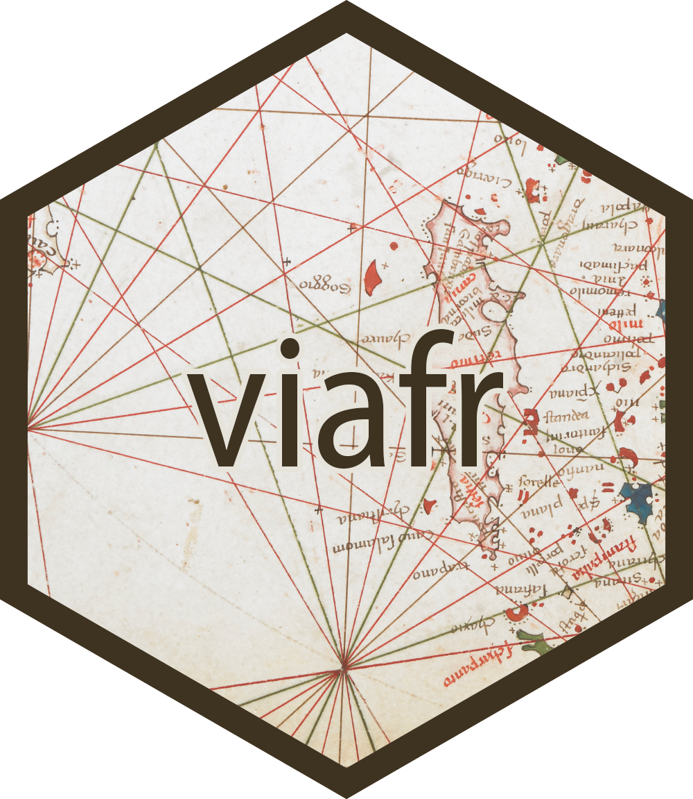

<!-- README.md is generated from README.Rmd. Please edit that file -->

# viafr 

[](https://www.tidyverse.org/lifecycle/#maturing)
[](https://doi.org/10.5281/zenodo.3265046)
[](https://cran.r-project.org/package=viafr)
[](https://travis-ci.org/stefanieschneider/viafr)
[](https://ci.appveyor.com/project/stefanieschneider/viafr)
[](http://codecov.io/github/stefanieschneider/viafr?branch=master)

## Overview

This R package uses the VIAF (Virtual International Authority File) API.
VIAF is an OCLC service that combines multiple LAM (Library, Archive,
and Museum) name authority files into a single name authority service.
It thus provides direct access to linked names for the same entity
across the world’s major name authority files, including national and
regional variations in language, character set, and spelling. For more
information go to <https://viaf.org/>.

## Installation

You can install the released version of viafr from
[CRAN](https://CRAN.R-project.org) with:

``` r
install.packages("viafr")
```

To install the development version from
[GitHub](https://github.com/stefanieschneider/viafr) use:

``` r
# install.packages("devtools")
devtools::install_github("stefanieschneider/viafr")
```

## Usage

The viafr package functions use the VIAF (Virtual International
Authority File) API. Optional VIAF API query parameters can be passed
into each function. For information on supported query parameters,
please see
<https://www.oclc.org/developer/develop/web-services/viaf/authority-cluster.en.html>.

`viaf_get()` returns a tibble, where each row contains information about
the respective VIAF identifier, whereas `viaf_search()` and
`viaf_suggest()` each produce a named list of tibbles, with each tibble
containing information about the respective search query. The MARC 21
field definitions are used, see, e.g.,
<https://www.loc.gov/marc/bibliographic/>.

### Get Data for VIAF Identifier(s)

``` r
(result_get <- viaf_get("15873"))
#> # A tibble: 1 x 4
#>   viaf_id source_ids        name_type      text               
#>   <chr>   <list>            <chr>          <list>             
#> 1 15873   <tibble [43 x 3]> Personal Names <tibble [241 x 15]>

# Retrieve a tibble of all source identifiers
(source_ids <- dplyr::pull(result_get, source_ids) %>% purrr::pluck(1))
#> # A tibble: 43 x 3
#>    id              scheme name                                                 
#>    <chr>           <chr>  <chr>                                                
#>  1 vtls000130420   RERO   RERO - Library Network of Western Switzerland        
#>  2 vtls002657273   EGAXA  Library of Alexandria                                
#>  3 9658            PTBNP  National Library of Portugal                         
#>  4 a10443824       BNC    National Library of Catalonia                        
#>  5 jn19990006541   NKC    National Library of the Czech Republic               
#>  6 LNC10-000029604 LNB    National Library of Latvia                           
#>  7 500009666       JPG    Union List of Artist Names [Getty Research Institute]
#>  8 a11549853       ERRR   National Library of Estonia                          
#>  9 XX1637941       BNE    National Library of Spain                            
#> 10 00452768        NDL    National Diet Library                                
#> # ... with 33 more rows

# Retrieve a tibble of data from all sources
(text <- dplyr::pull(result_get, text) %>% purrr::pluck(1))
#> # A tibble: 241 x 15
#>       id count a            b     c     d      e     f     g     q     `4`   `5`   `7`   `8`   `9`  
#>    <int> <int> <chr>        <chr> <chr> <chr>  <chr> <chr> <chr> <chr> <chr> <chr> <chr> <chr> <chr>
#>  1     1    24 Picasso, Pa~ <NA>  <NA>  1881-~ <NA>  <NA>  <NA>  <NA>  <NA>  <NA>  <NA>  <NA>  <NA> 
#>  2     1     5 Picasso, Pa~ <NA>  <NA>  <NA>   <NA>  <NA>  <NA>  <NA>  <NA>  <NA>  <NA>  <NA>  <NA> 
#>  3     1     5 Ruiz y Pica~ <NA>  <NA>  1881-~ <NA>  <NA>  <NA>  <NA>  <NA>  <NA>  <NA>  <NA>  <NA> 
#>  4     1     4 Picasso Rui~ <NA>  <NA>  1881-~ <NA>  <NA>  <NA>  <NA>  <NA>  <NA>  <NA>  <NA>  <NA> 
#>  5     1     4 Ruiz, Pablo  <NA>  <NA>  1881-~ <NA>  <NA>  <NA>  <NA>  <NA>  <NA>  <NA>  <NA>  <NA> 
#>  6     1     4 Picasso      <NA>  <NA>  1881-~ <NA>  <NA>  <NA>  <NA>  <NA>  <NA>  <NA>  <NA>  <NA> 
#>  7     1     3 Bijiasuo     <NA>  <NA>  1881-~ <NA>  <NA>  <NA>  <NA>  <NA>  <NA>  <NA>  <NA>  <NA> 
#>  8     1     3 Picasso      <NA>  <NA>  <NA>   <NA>  <NA>  <NA>  <NA>  <NA>  <NA>  <NA>  <NA>  <NA> 
#>  9     1     3 Picasso, Pa~ <NA>  <NA>  1881-~ <NA>  <NA>  <NA>  <NA>  <NA>  <NA>  <NA>  <NA>  <NA> 
#> 10     1     3 Ruiz Picass~ <NA>  <NA>  1881-~ <NA>  <NA>  <NA>  <NA>  <NA>  <NA>  <NA>  <NA>  <NA> 
#> # ... with 231 more rows

# Aggregate name variants and show dominant ones 
# (subfield code `a` declares personal names)
dplyr::mutate(text, name_variant = a) %>% dplyr::group_by(name_variant) %>% 
  dplyr::summarise(count = sum(count)) %>% dplyr::filter(count > 9)
#> # A tibble: 3 x 2
#>   name_variant   count
#>   <chr>          <int>
#> 1 Pablo Picasso     27
#> 2 Picasso           14
#> 3 Picasso, Pablo    34
```

### Search VIAF records

``` r
(result_search <- viaf_search("Menzel", maximumRecords = 5))
#> $Menzel
#> # A tibble: 5 x 4
#>   viaf_id                source_ids       name_type                 text            
#>   <chr>                  <list>           <chr>                     <list>          
#> 1 9958151474888800490000 <tibble [1 x 3]> Uniform Title Expressions <tibble [2 x 8]>
#> 2 9951148269716905230007 <tibble [1 x 3]> Uniform Title Expressions <tibble [2 x 9]>
#> 3 9864149198241274940009 <tibble [2 x 3]> Personal Names            <tibble [1 x 3]>
#> 4 9771155286606387180001 <tibble [1 x 3]> Personal Names            <tibble [1 x 3]>
#> 5 9738151247971644270003 <tibble [1 x 3]> Personal Names            <tibble [1 x 3]>

# Retrieve a tibble of all source identifiers
(source_ids <- dplyr::pull(result_search$`Menzel`, source_ids))
#> [[1]]
#> # A tibble: 1 x 3
#>   id                scheme name                     
#>   <chr>             <chr>  <chr>                    
#> 1 VIAFEXP1010942752 XR     xR Extended Relationships
#> 
#> [[2]]
#> # A tibble: 1 x 3
#>   id              scheme name                     
#>   <chr>           <chr>  <chr>                    
#> 1 VIAFEXP83155351 XR     xR Extended Relationships
#> 
#> [[3]]
#> # A tibble: 2 x 3
#>   id        scheme name                   
#>   <chr>     <chr>  <chr>                  
#> 1 172842131 DNB    German National Library
#> 2 90818949  BIBSYS BIBSYS                 
#> 
#> [[4]]
#> # A tibble: 1 x 3
#>   id            scheme name                                         
#>   <chr>         <chr>  <chr>                                        
#> 1 vtls027534815 RERO   RERO - Library Network of Western Switzerland
#> 
#> [[5]]
#> # A tibble: 1 x 3
#>   id         scheme name                   
#>   <chr>      <chr>  <chr>                  
#> 1 1146425104 DNB    German National Library

# Retrieve a tibble of data for the second search result
(text <- dplyr::pull(result_search$`Menzel`, text) %>% purrr::pluck(2))
#> # A tibble: 2 x 9
#>      id count a           d       f     l      s         t                                   `0`    
#>   <int> <int> <chr>       <chr>   <chr> <chr>  <chr>     <chr>                               <chr>  
#> 1     1     1 Müller-Bro~ 1914-1~ 1961  German "Menzel-~ Graphic artist and his design prob~ (viaf)~
#> 2     1     1 Müller-Bro~ 1914-1~ 1961  <NA>   "Menzel-~ Gestaltungsprobleme des Grafikers   <NA>
```

### Suggest VIAF records

``` r
(result_suggest <- viaf_suggest("austen"))
#> $austen
#> # A tibble: 10 x 5
#>    viaf_id               source_ids        name_type      text                                 score
#>    <chr>                 <list>            <chr>          <chr>                                <chr>
#>  1 102333412             <tibble [12 x 3]> Personal Names Austen, Jane, 1775-1817              14930
#>  2 9943394               <tibble [8 x 3]>  Personal Names Austen Henry Layard, 1817-1894       4914 
#>  3 66482160              <tibble [7 x 3]>  Personal Names Austen Chamberlain, 1863-1937        3808 
#>  4 49253679              <tibble [9 x 3]>  Personal Names Austen, J. L., 1911-1960             3443 
#>  5 76472664              <tibble [6 x 3]>  Personal Names Austen-Leigh, James Edward, 1798-18~ 2638 
#>  6 3256795               <tibble [4 x 3]>  Personal Names Austen, Ernest Edward, 1867-1938     2024 
#>  7 22268931              <tibble [4 x 3]>  Personal Names Austen, Ralph A                      1886 
#>  8 64067073              <tibble [5 x 3]>  Personal Names Austen, K. Frank                     1803 
#>  9 69175936              <tibble [5 x 3]>  Personal Names Austen, John 1886-1948               1747 
#> 10 351144783162295221357 <tibble [3 x 3]>  Personal Names Austen Ivereigh                      1739

# Retrieve source identifiers for the most relevant search result
dplyr::filter(result_suggest$`austen`, score > 10000) %>%
  dplyr::pull(source_ids) %>% purrr::pluck(1)
#> # A tibble: 12 x 3
#>    id            scheme name                                                              
#>    <chr>         <chr>  <chr>                                                             
#>  1 n79032879     LC     Library of Congress/NACO                                          
#>  2 118505173     DNB    German National Library                                           
#>  3 207420        SELIBR National Library of Sweden                                        
#>  4 adv10179859   BAV    Vatican Library                                                   
#>  5 11889603      BNF    National Library of France                                        
#>  6 500249665     JPG    Union List of Artist Names [Getty Research Institute]             
#>  7 cfiv017136    ICCU   Central Institute for the Union Catalogue of the Italian libraries
#>  8 xx1124986     BNE    National Library of Spain                                         
#>  9 vtls000823272 EGAXA  Library of Alexandria                                             
#> 10 jn19990000321 NKC    National Library of the Czech Republic                            
#> 11 000035010277  NLA    National Library of Australia                                     
#> 12 8531          PTBNP  National Library of Portugal
```

## Contributing

Please report issues, feature requests, and questions to the [GitHub
issue tracker](https://github.com/stefanieschneider/viafr/issues). We
have a [Contributor Code of
Conduct](https://github.com/stefanieschneider/viafr/blob/master/CODE_OF_CONDUCT.md).
By participating in viafr you agree to abide by its terms.
